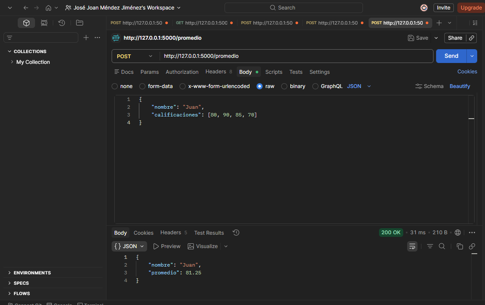
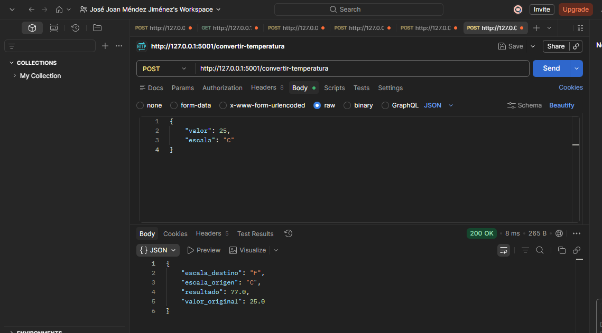
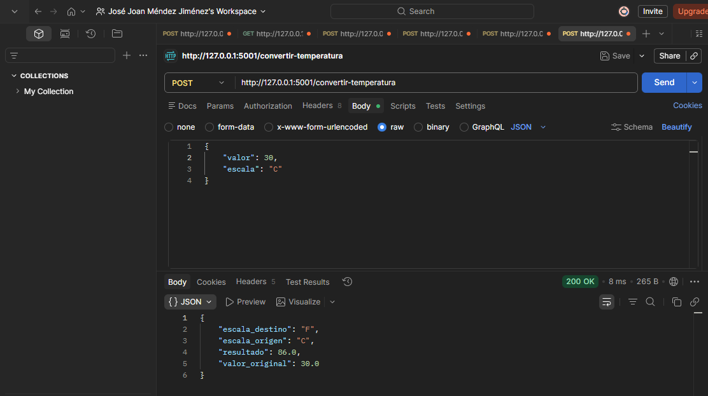
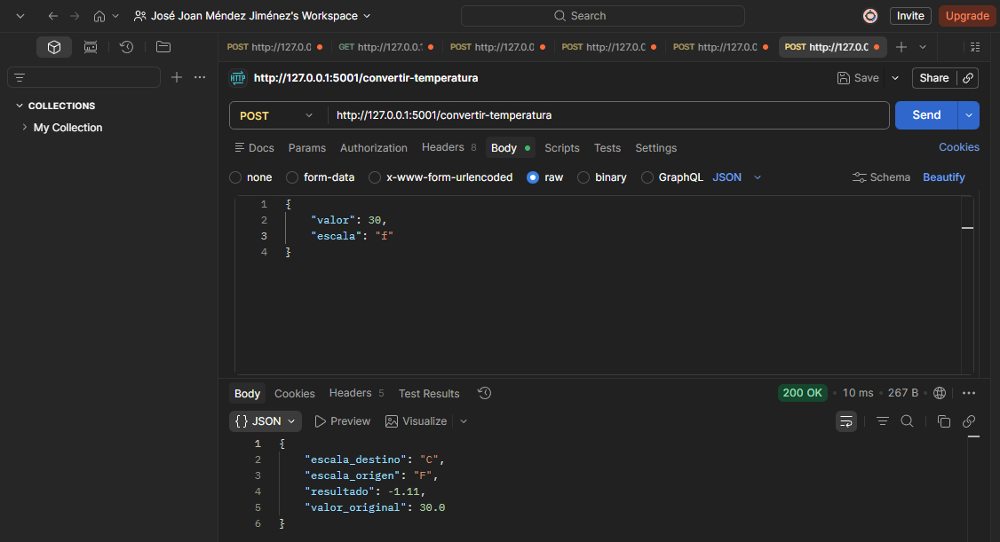

# Tarea 3.9: API Ejercicios (Conversor, Promedio)

## Tecnologías Utilizadas
* Python
* Flask
* Postman (para pruebas de los endpoints)

## Evidencias de Funcionamiento

### Ejercicio 1: API de Promedio
*(Petición POST que recibe calificaciones y devuelve el promedio)*

**Evidencia de funcionamiento en Postman:**

---

### Ejercicio 2: API Conversor de Unidades
*(Petición POST que convierte temperaturas entre grados Celsius y Fahrenheit)*

**Evidencia 1:**

**Evidencia 2:**

**Evidencia 3:**

